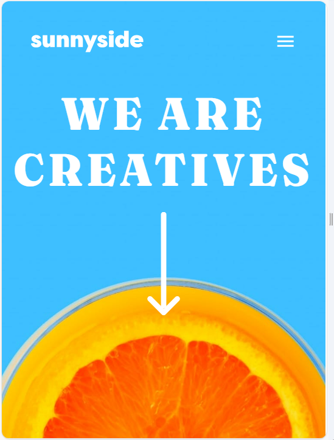

# Frontend Mentor - Sunnyside agency landing page solution

This is a solution to the [Sunnyside agency landing page challenge on Frontend Mentor](https://ad9-1.github.io/Sunnyside-Agency/). 

### The challenge

Users should be able to:

- View the optimal layout for the site depending on their device's screen size 
Mobile : 320 px -1083 px
Desktop: 1440 px
- See hover states for all interactive elements on the page
Hovers on navigation

transform(scale 0.8)

### Screenshot



.png>)

### Links

- Solution URL: [https://github.com/AD9-1/Sunnyside-Agency]
- Live Site URL: [https://ad9-1.github.io/Sunnyside-Agency/]

### Built with

- Semantic HTML5 markup
- CSS custom properties
- Flexbox
- CSS Grid
- SaSS
- Desktop-first workflow
- [React](https://reactjs.org/) - JS library
- [Styled Components](https://mui.com/material-ui/) - For icons


### What I learned

```React *(Hamburger Menu)

const Navbar = () => {
  const [expandbar, setExpandBar] = useState("false");
  const location = useLocation();

  useEffect(() => {
    setExpandBar(false);
  }, [location]);

  const handleClick = () => {
    setExpandBar(!expandbar);
  };
  useEffect(() => {
    const handleResize = () => {
      if (window.innerWidth > 375) {
        setExpandBar(false);
      }
    };
    window.addEventListener("resize", handleResize);
  }, []);
}

```css (Hover transitions)
 &:hover {
            background-color: $yellow;
            text-transform: uppercase;
            border-radius: 1rem;
            color: $dark-blue;
            font-family: Fraunces;
 }
```

```js (displaying Browser Routes in SPA)
function App() {
  return (
    <BrowserRouter>
      <div className="background">
        {" "}
        <Navbar />
        <Hero />
      </div>
      <Banner />
      <Feedback />
      <Gallery/>
      <Footer/>
    </BrowserRouter>
  );
}
```


### Continued development

React JS
Node JS
Express JS
React Native


## Author

- Website - [Sehaj Wadhwa](https://www.linkedin.com/in/sehajdeep-wadhwa/)
- Website - [Aparna Dhara](https://aparna-dhara.netlify.app/)
- Frontend Mentor - [@SehajWadhwa](https://www.frontendmentor.io/profile/sehajwadhwa)
- Frontend Mentor - [@yourusername](https://www.frontendmentor.io/profile/AD9-1)


## Acknowledgments

We worked in team of 2 front-end developers. We developed the project in ReactJS as collaborators. 
Contributors : Aparna Dhara and Sehaj Wadhwa
